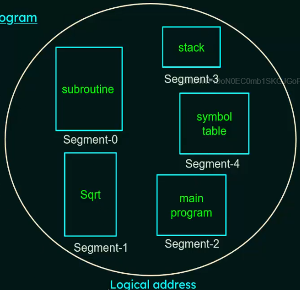

# Main memory management

## Intro

- The main purpose of a computer system is to execute programs.

- During execution, these programs, along with the data they access, must be in the main memory at least partially.

- In CPU scheduling, we saw how the CPU can be shared by a set of process. As a result, speed of the system's response to its users could be improved.

- To realize this increase in performance, we must keep several processes in memory, ie we must share memory.

## Hardware structure

- Memory consists of large arrays of words or bytes, each with own address.

- The CPU fetches instructions from memory according to the value of the program counter.

- These instructions may cause additional loading from and storing to specific memory addresses.

## Typical instruction-execution cycle

- First fetch instruction from memory.

- Decode instruction and fetch operands from memory if needed.

- Execute the instruction on the operands and store the results back in memory.

### Note

- The CPU can directly access only the registers built in it and the main memory.

- The machine instructions that take memory addresses are arguments, but none that take disk addresses.

- So, any instructions in execution, and any data being used by instructions, must be in one of these direct-access storage devices.

- If the data are not in memory, they must be moved there before the CPU can operate on them.

## CPU cycle time for accessing memory

- Registers

  Accessible within one cycle of the CPU clock. Most CPUs can decode instructions and perform simple operations on register contents @ one or more operations per clock tick.

- Main memory

  Access may take many cycles of the CPU clock to complete. In this case, CPU normally needs to stall, since it does not have the data required to complete instruction that it is executing.

  A cache memory is used between the CPU and RAM as a memory buffer used to accommodate a speed differential.

## Protection of OS from unauthorized access

- OS has to be protected from access by user processes.

- In addition, user processes must be protected from one another.

- This protection must be provided by the hardware.

- To achieve this, we ensure that each process has a separate memory space. We need the ability to determine the range of legal addresses that the process may access and to ensure that the process can access only these legal addresses.

- For this, we use two registers `BASE` and `LIMIT`.

- These registers define a logical address space. The base register holds the smallest legal memory address and limit specifies the size of the range.

- The base and limit registers can be loaded only by OS, which uses special privileged instruction.

- Since privileged instructions can be executed only in kernel mode, and only OS can executes in kernel mode.

- This scheme allows the OS to change the value of the registers but prevents user programs from changing the registers' contents.

## Address binding

- A program resides on the disk as a binary executable file.

- To be executed, the program must be brought into memory and placed with a process.

- Depending on the memory management in use, the process may be moved between disk and memory during its execution.

- The processes on the disk that are waiting to be brought into memory for execution form the input queue.

- Input queue -> selects a process -> loads it into memory -> executes and accesses instructions and data from memory -> process terminates -> memory is declared available.

- Most systems allow a user process to reside in any part of the physical memory.

- A user process may not have physical address always at 0000.

- In most cases, a user program will go through several steps during compile time, load time, execution time before being executed.

- Addresses may be represented in different ways during these steps.

  - Source program: Addresses are generally symbolic (such as count).

  - Compiler: Typically binds these symbolic addresses to relocate addresses (such as 14 bytes away from beginning of the module)

  - Linkage editor/loader: Binds the relocatable addresses to absolute addresses (such as 74014)

- Each binding is a mapping from one address space to another.

### Binding of instructions & data to memory address during Compile time

- If we know at compile time where the process will reside in memory, then absolute code can be generated.

- If we know that a user process will reside at location R, then the generated compiler code will start at that location and extend up from there.

- If at some later time, the starting location changes, then it will be necessary to recompile this code.

### Binding of instructions & data to memory address during Load time

- If it is not known at compile time where the process will reside in memory, then the compiler must generate relocatable code.

- In this case, the final binding is delayed until load time. If the starting address changes, we need only reload the user code to incorporate this changed value.

### Binding of instructions & data to memory address during Execution time

- Also called run time binding or dynamic binding.

- If the process can be moved during its execution from one memory segment to another, then binding must be delayed until run time.

- Special hardware must be available for this scheme to work. Most general-purpose OSs use this method.

## Logical vs physical address spaces

- Logical address: An address generated by the CPU

- Physical address: An address seen by the memory unit, that is the one loaded into the memory address register of the memory.

- Compile-time and load-time address-binding method generate identical logical and physical addresses.

- Execution-time address binding scheme results in differing logical and physical addresses.

- In this case, we usually refer to logical address as virtual address.

- Logical address space: A set of all logical addresses generated by a program.

- Physical address space: A set of all physical addresses corresponding to these logical addresses.

- In execution-time address-binding scheme, the logical and physical address spaces differ.

- The run-time mapping from virtual to physical addresses is done by a hardware device called the Memory Management Unit (MMU)

## Dynamic relocation using a relocation register

- CPU generates logical address, say 238.

- MMU contains starting physical address for that particular program, say 15000.

- Add logical address to the relocation register to get the corresponding physical address, ie 15238.

## Dynamic loading

- We've discussed that the entire program and all data of a process must be in RAM for the process to execute.

- The size of the process is thus limited to the size of the physical memory.

- To obtain better memory-space utilization, we use dynamic loading.

- With dynamic loading, a routine is not loaded until it is called.

- All routines are kept on disk in a relocatable load format.

- The main program is loaded into memory and is executed.

- When a routine needs to call another routine, the calling routine first checks to see whether the other routine has been loaded.

- If not, the relocatable linking loader is called to load the desired routine into memory and to update the program's address tables to reflect this change.

- Then control is passes to the newly loaded routine.

- Dynamic loading does not require special support from the OS. It is responsibility of the devs to design their programs to take advantage of such a method.

- Ads

  - An unused routine is never loaded.

  - This method is useful when large amounts of code are needed to handle infrequently occurring cases.

  - Although the total program size may be large, the portion that is uses (and hence loaded) may be much smaller.

## Dynamic linking and Shared libraries

(Not in syllabus)

- When a program runs, apart form its own modules, it also needs to use certain system libraries as well.

- First let us see what is static linking. System language libraries are treated like any other object module and are combined by the loader into the binary program image. The disadvantage of this is that each program on a system must include a copy of its language library in the executable file. This wastes disk space and main memory.

- In dynamic linking, it checks to see whether the needed routine is already in memory. If not, the routine is loaded into memory.

- The concept of dynamic linking is similar to that of dynamic loading. But here, linking rather than loading, is postponed until execution time.

## Swapping

- A process must be in memory to be executed.

- A process, however, can be swapped temporarily out of memory to a backing store and then brought back into memory for continued execution. (Example, in RR scheduling algo, when a quantum expires, the process is swapped with the next)

### Backing store

- It must be a fast disk.

- It must be large enough to accommodate copies of all memory images of all users.

- It must provide direct access to these memory images.

- The system maintains a ready queue consisting of all processes whose memory images are on the backing store or in memory and are ready to run.

- Whenever the CPU scheduler decides to execute a process, it calls the dispatcher.

- The dispatcher checks to see whether the next process in the queue is in memory.

- If it is not, and if there is no free memory region, the dispatcher swaps out a process currently in memory and swaps in desired process.

- It then reloads registers and transfers control to the selected process.

## Swap time

- The context-switch time in a swapping system is fairly high.

- Consider Process size = 10MB

  Transfer rate of backing store = 40MB/s

  Transfer to/from will take 0.25s ie 250ms

  Assuming 8ms of latency 258ms

  Both ways 516ms

- For efficient CPU utilization, we want the execution time for each process to be longer than the swap time.

## Factors that affect swapping

- Total transfer time is directly proportional to the amount of memory swapped.

- A process must be completely idle in order to be swapped.

- A process may be waiting for an IO operation when we want to swap it to free up memory. If the IO is asynchronously accessing the user memory for IO buffers, then the process cannot be swapped.

## Memory allocation

- How to allocate memory?

- Divide memory into several fixed-sized partitions.

- Each partition may contain exactly one process.

- When a partition is free, a process is selected from the input queue and is loaded in the free partition.

- When the process terminates, the partition becomes available for another process.

- This is one of simplest methods for allocating memory

## Dynamic storage allocation problems

1. First fit

   Allocate the first block that is big enough.

2. Best fit

   Allocate the smallest block that is big enough.

3. Worst fit

   Allocate the largest block.

## Fragmentation

- As processes are loaded and removed from memory, the free memory space is broken into little pieces which results in fragmentation.

- Can be of two types:

  - External fragmentation

  - Internal fragmentation

### External fragmentation

- Exists when there is enough total memory space to satisfy a request, but the available spaces are not continuous.

- Storage is fragmented into large number of small holes

- This fragmentation problem can be severe. In the worse case, we could have a block of free (or wasted) memory between every two processes.

- If all these small pieces of memory were in one big free block instead, we might be able to run several more processes.

#### Solution - Compaction

- Shuffle the memory contents so as to place all free memory together in one large block.

- But compaction is not always possible. If relocation is static and is done at assembly or load time, compaction cannot be done.

- Compaction is only possible if relocation is dynamic and is done at execution time.

### Internal fragmentation

- It occurs when memory blocks assigned to processes are bigger than what the process actually needs.

- Some portion of memory is left unused as it cannot be used by another process.

## Paging

- Paging is a memory-management scheme that permits the physical address space of a process to be non-continuous.

- Paging avoids the considerable problem of fitting memory chunks of varying sizes onto the backing store.

- Most memory-management schemes discussed earlier suffered from this problem.

### Method of paging

- Break physical memory into fixed-sized blocks called frames.

- Break logical memory into blocks of the same size called pages.

- When a process is to be executed, its pages are loaded into any available memory frames from the backing store.

- The backing store is divided into fixed-sized blocks that are of the same size as the memory frames.

## Page table

- Every address generated by the CPU is divided into two parts: page number `p` and page offset `d`.

- Page number is used as in index into a page table.

- Page offset is the displacement within the page.

- The page table contains the base address of each page.

- This base address is combined with the page offset to define the physical memory address that is sent to the memory unit.

## Hardware implementation of page table

Case 1: Implement the page table as a set of dedicated registers.

- Problem: This can be used only when page table is reasonably small.

Case 2: Keep the page table in main memory and a page-table base register (PTBR) points to the page table.

- Problem: The time required to access a user memory location is increased as there are two memory accesses needed to access a byte (one for the page-table entry, one for the byte)

Case 3: Use of Translation lookaside buffer (TLB)

### Translation lookaside buffer

- TLB is an associative, high-speed memory which consists of key and value.

- When the associative memory is presented with an item, the item is compared with all keys simultaneously.

- If the item is found, the corresponding value field is returned and the search is fast.

### Usage of TBL with page table

- The TLB contains only a few of the page-table entries

- When a logical address is generated by the CPU, its page number is presented to the TLB.

- If the page number is found, its frame number is immediately available and is used to access memory and is called TLB Hit.

- If the page number is not in the TLB, a memory reference to the page table must be made, and is called TLB Miss.

- When the frame number is obtained, we can use it to access memory.

- Also we add the page number and frame number to the TLB, so that they will be found quickly on the next reference.

## Page table entries

- Frame number denotes the frame where the page is present in the main memory. The number of bits required for this depends on the number of frames in the main memory.

- Present/absent bit specifies whether the page is present in the main memory or not. Also called valid/invalid bit. If the page we're looking for is not in main memory, it is called Page fault.

- Other bits not in syllabus.

## Segmentation

- Segmentation is another non-continuous allocation techniques like paging.

- Unlike paging, in segmentation, the processes are not divided into fixed size pages.

- Instead, the processes are divided into several modules called segments which improves the visualization for the devs.

- So, here both secondary memory and main memory are divided into partitions of equal sizes.

- A logical address space is a collection of segments.

- Each segment has a name of a length.

- The addresses specify both the segment name and the offset within the segment.

- The user therefore specifies each address by a segment name and an offset.

- While in paging, the dev specifies only a single address, which is partitioned by the hardware into a page number and offset that is all invisible to the dev.

Dev's view of a program

### Segment table

- We must define an implementation to map 2D user-defined addresses into 1D physical addresses.

- This mapping is done by segment table/

- Each entry in the segment table has a segment base and a segment limit.

- The segment base contains the starting physical address where the segment resides in memory, whereas the segment limit specifies the length of the segment.

## Segmentation hardware

- A logical address consists of two parts: a segment number `s` and an offset into that segment `d`.

- The segment number is used as an index to the segment table.

- The offset of the logical address must be between 0 and the segment limit.

- If it is not, we trap to the OS that logical addressing attempted beyond end of segment.

- When an offset is legal, it is added to the segment base to produce the address in physical memory of the desired byte.
